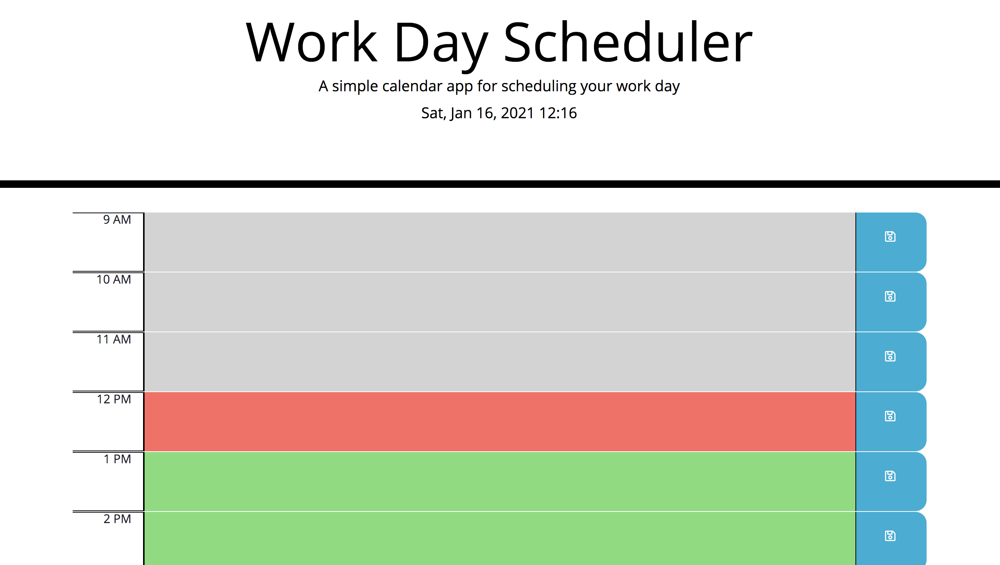
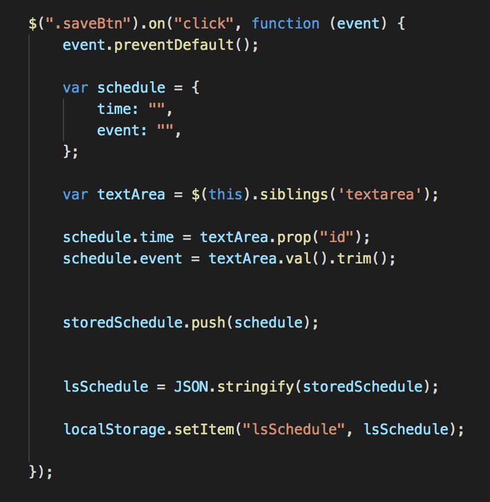
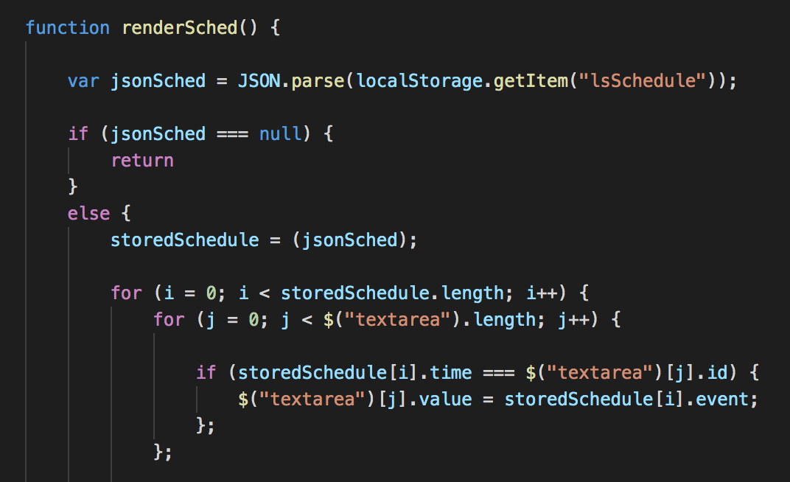

# day-planner

A simple, javascipt day planner with hours 9 am - 5pm to schedule your work day utilizing day.js. Referencine day.js allows the app to access the current date and time. As the day progresses, the time blocks change from green for future events to red for the current hour to grey for past events. 

When the save button is pressed, the text entered is saved to local storage and upon reload will re-populate the planner in the appropriate time block. This is accomplished using the `$(this).siblings` jquery method and cycling through the array of objects selected with `$("textarea")`, comparing the appropriate id to the key in the `schedule` object.

The deployed app can be found at <a href = "https://liztownd.github.io/day-planner/">https://liztownd.github.io/day-planner/</a>.

Thanks to Matt C. for helping to debug local storage issues and Koton D. for helping with local storage and repopulating text areas.